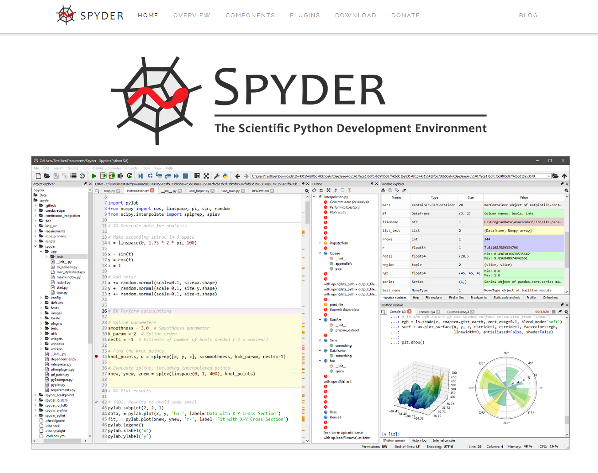

# Spyder Website

*Copyright © 2016- Spyder Website Contributors and others (see [AUTHORS.txt](https://github.com/spyder-ide/website-spyder/blob/master/AUTHORS.txt))*

<!-- Project status -->

<!-- Build and deploy status -->

This is the repository for the Spyder IDE website at [Spyder-IDE.org](https://www.spyder-ide.org/)
It is built using [Lektor](https://www.getlektor.com/), deployed via [GitHub Actions](https://github.com/features/actions) and served by [GitHub Pages](https://pages.github.com/), hosted on a custom domain.
The frontend is our very own [Lektor-Icon theme](https://spyder-ide.github.io/lektor-icon/), whose [documentation](https://github.com/spyder-ide/lektor-icon) should be consulted for details on what the various options do.

<!-- markdownlint-disable -->
<!-- START doctoc generated TOC please keep comment here to allow auto update -->
<!-- DON'T EDIT THIS SECTION, INSTEAD RE-RUN doctoc TO UPDATE -->

- [Contributing to the website](#contributing-to-the-website)
- [Workflow](#workflow)
- [Technologies and libraries used](#technologies-and-libraries-used)
  - [Lektor plugins](#lektor-plugins)
- [More information](#more-information)

<!-- END doctoc generated TOC please keep comment here to allow auto update -->
<!-- markdownlint-restore -->

## Contributing to the website

Content contributions and bug fixes/improvements are welcome!
For information on how to contribute to the site, including reporting issues, setting up a development environment and patching code, see the [Contributing Guide](https://github.com/spyder-ide/website-spyder/blob/master/CONTRIBUTING.md).
Thanks!

## Workflow

The default branch is ``master``, which is continuously deployed with a Github Action to Github Pages at the domain [Spyder-IDE.org](https://spyder-ide.org/).

## Technologies and libraries used

This website is built using [Lektor](https://www.getlektor.com/), a static web generator that can be customized using [Jinja2](http://jinja.pocoo.org/) templates.

### Lektor plugins

The build also requires several [Lektor plugins](https://www.getlektor.com/docs/plugins/) (no extra configuration is needed; Lektor automatically installs them when building):

* [atom](https://github.com/lektor/lektor-atom)
* [disqus-comments](https://github.com/lektor/lektor-disqus-comments)

## More information

[Main Website](https://www.spyder-ide.org/)

[Download Spyder (with Anaconda)](https://www.anaconda.com/download/)

[Online Documentation](https://docs.spyder-ide.org/)

[Spyder Github](https://github.com/spyder-ide/spyder)

[Troubleshooting Guide and FAQ](https://github.com/spyder-ide/spyder/wiki/Troubleshooting-Guide-and-FAQ)

[Development Wiki](https://github.com/spyder-ide/spyder/wiki/Dev:-Index)

[Gitter Chatroom](https://gitter.im/spyder-ide/public)

[Google Group](https://groups.google.com/group/spyderlib)

[@Spyder_IDE on Twitter](https://twitter.com/spyder_ide)

[@SpyderIDE on Facebook](https://www.facebook.com/SpyderIDE/)

[Support Spyder on OpenCollective](https://opencollective.com/spyder/)
